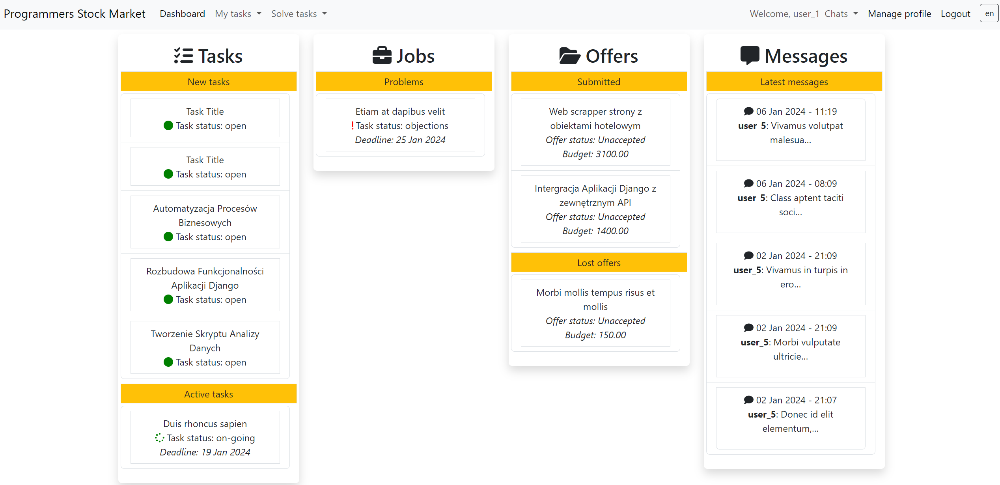

# Programmers-stock-market

* [Description](#description)
* [Tech-stack](#tech-stack)
* [Live demo](#live-demo)
* [Setup](#setup)
* [Tests](#tests)
* [Contributors](#contributors)
* [Screenshot](#screenshot)


## Description
<b>General info</b><br>
This web application simplifies access to programming services for those seeking help, and connects freelance programmers with potential clients. It serves as a platform where clients can post coding tasks and programmers can offer their services. The user interface is available in English and Polish. The application is designed to facilitate smooth interactions and transactions between clients and programmers. Additionally, the application allows direct communication between users through a chat feature using WebSocket.

<details><summary><b>Application purpose</b></summary>
The primary goal of this application is to create a marketplace where users can publish programming tasks and receive multiple offers from freelance programmers. Once the task is completed, clients can review the submitted solutions, accept them, and proceed with payment. This system aims to streamline the process of finding and hiring programming talent while ensuring quality and satisfaction for both parties involved.</details>

<details><summary><b>Application flow</b></summary>

1. Register and login
2. Select your role: client (CL) or contractor (CO)
3. (CL) Publish a task, set a budget, and define the task completion time
4. (CO) Find a task that matches your tech stack and respond with a price offer
5. (CL) Choose and accept an offer from a programmer
6. (CO) Prepare and submit your solution
7. (CL) Review the solution and accept or decline it
8. (CL/CO) If declined, discuss the issues or use an arbiter
9. (CL) If the solution is accepted, pay the programmer

</details>

## Tech-stack
<ul>
<li><b>Backend:</b></li>
   <ul>
   <li>Python 3.11</li>
   <li>Django 4.2</li>
   <li>Celery (used for asynchronous task processing, such as sending emails and notifications)</li>
   <li>Redis (used as a message broker for Celery and as a channel layer for Django Channels)</li>
   <li>Sendgrid (used for sending emails)</li>
   <li>Django Channels (with Daphne for WebSocket support)</li>
   </ul>
<li><b>Frontend:</b></li>
   <ul>
   <li>HTML/CSS</li>
   <li>Bootstrap 5</li>
   <li>FontAwesome</li>
   <li>JavaScript</li>
   </ul>
<li><b>Database:</b></li>
   <ul>
   <li>PostgreSQL</li>
   </ul>
<li><b>Communication:</b></li>
   <ul>
   <li>WebSocket (via Django Channels and Channels-Redis)</li>
   </ul>
<li><b>Testing:</b></li>
   <ul>
   <li>Django unit tests</li>
   <li>Pytest (for live tests with Selenium)</li>
   <li>Selenium</li>
   <li>Factory Boy</li>
   <li>Mock</li>
   </ul>
<li><b>Code Quality and Development Tools:</b></li>
   <ul>
   <li>Black (code formatter)</li>
   <li>isort (import sorter)</li>
   <li>Poetry (dependency management)</li>
   </ul>
<li><b>Deployment:</b></li>
   <ul>
   <li>Docker Compose (local)</li>
   <li>mikr.us (live server)</li>
   </ul>
</ul>

## Live-demo
We have prepared a live demo of the app on Mikr.us server. Please sign up and feel free to test it.<br>
[stockmarket.toadres.pl](https://stockmarket.toadres.pl)

## Setup
<details><summary><b>Poetry</b></summary>
We use Poetry for dependency management and packaging.<br>

* Install dependencies: `poetry install`<br>
* Install with development packages: `poetry install --with dev --sync`
* More information about Poetry - [python-poetry.org/docs/basic-usage/#installing-dependencies](https://python-poetry.org/docs/basic-usage/#installing-dependencies)
</details>

<details><summary><b>Deployment - General Info</b></summary>

1. Select a folder depending on the installation you need.
<ul>
 <li> Local - deployment/local
 <li> Mikr.us - deployment/mikrus
 </ul>

2. Set the environment variables based on the env_example file. The description for each installation is below.
3. Open a terminal and build the Docker containers:
    ```bash
    docker-compose -f docker-compose.yml up --build -d
    ```

</details>

<details><summary><b>Local - Environments</b></summary>

To use app locally with docker, rename the env_example file to .env and set the environment variables:
```
DEBUG=True # for development
SECRET_KEY=<YOUR_SECRET_KEY>
DJANGO_SETTINGS_MODULE=psmproject.settings.development
HOST_NAME=http://localhost:8000
DB_ENGINE=django.db.backends.postgresql_psycopg2
POSTGRES_HOST=stock-market-db
POSTGRES_DB=postgres
POSTGRES_USER=postgres
POSTGRES_PASSWORD=postgres
POSTGRES_PORT=5432
CELERY_BROKER_URL=redis://redis:6379
CELERY_RESULT_BACKEND=redis://redis:6379
REDIS_HOST=redis
REDIS_PORT=6379
```
</details>

<details><summary><b>Mikr.us - Environments</b></summary>

To use the Mikr.us server, rename the env_example file to .env and set the environment variables:
```
# GLOBAL
DJANGO_SETTINGS_MODULE=psmproject.settings.mikrus
HOST_NAME=https://host.name.com
IP4_PORT=<ip port>
SECRET_KEY=<key>
TZ=Europe/Warsaw
# DATABASE
POSTGRES_ENGINE=django.db.backends.postgresql_psycopg2
POSTGRES_DB=db_name
POSTGRES_USER=db_user
POSTGRES_PASSWORD=db_pass
POSTGRES_HOST=stock-market-db
POSTGRES_PORT=5432
# REDIS
REDIS_HOST=redis
REDIS_PORT=6379
# MAIL
SENDGRID_API_KEY=<key>
DEFAULT_FROM_EMAIL=<email address>
# ADMIN CREDENTIALS
ADMIN_USER=<admin_user>
ADMIN_EMAIL=<adminuser@adminmail.mail>
ADMIN_PASS=<admin_password>
```
</details>

<details><summary><b>OAuth2</b></summary>
Before setting up providers in the application you must register your app on every provider developer console to retrieve client ID and secret.

Our app supports OAuth implementation for Google, LinkedIn and GitHub. If further details about provider specifics is needed please refer to this [link](https://docs.allauth.org/en/latest/socialaccount/providers/index.html).<br>
The callback URL to be set on provider developer console should look as follows: <br>
http://[your-domain]/accounts/[provider-name]/login/callback/

Steps to Configure OAuth Providers in the app:

1. Register Your Domain:
   - Through the admin panel, go to the "Sites" model.
   - Update the existing instance "example.com" with the domain you will use.

2. Configure the Provider:
   - Create a new instance in "Social Applications".
   - Choose the appropriate provider.
   - Enter the client ID and secret you retrieved when registering your app.
   - Add your domain (site) to the chosen sites.
   - Save the configuration.

For further documentation, please check [allauth documentation](https://docs.allauth.org/en/latest/index.html).
</details>


## Tests
Unit tests are implemented in Django to verify the functionality of models, views, and forms in isolation. Integration tests use Selenium and pytest to simulate user interactions and ensure the application works as a whole. These tests are executed within Docker containers to provide a consistent environment.

## Contributors
- [rafal-gbc](https://github.com/rafal-gbc)
- [Nicolas Destrieux](https://github.com/ndestrieux)
- [Bartosz Wisniewski](https://github.com/bartwisniewski)
- [Adam Jaworski](https://github.com/adamj2k)
- [ZduBart](https://github.com/ZduBart)

## Screenshot

